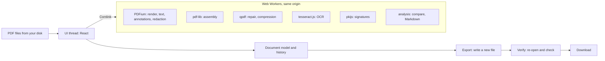

<div align="center">


<h1>Recto</h1>

**A PDF editor that runs entirely in your browser. Nothing is uploaded.**

Open many PDFs, arrange their pages on one light table, annotate, fill, redact, edit text,
recognise scans, compare, sign.

[Open the app](https://erendenizk.github.io/recto/) · [How it works](#how-it-works) · [What it does not do](#what-it-does-not-do) · [Roadmap](docs/ROADMAP.md)

[](https://github.com/ErenDenizK/recto/actions/workflows/ci.yml)
[](https://github.com/ErenDenizK/recto/releases)
[](LICENSE)

</div>

<a href="https://erendenizk.github.io/recto/"></a>

**Status:** public beta (`1.0.0-beta` versions, [ADR-0017](docs/adr/0017-versioning-and-releases.md)).
Built and maintained by one person; not audited by a third party. The end-to-end tests run in
Chromium, Firefox and WebKit on every push ([`ci.yml`](.github/workflows/ci.yml)).

## Why it exists

Your files stay on your device, and you can check that. Pages are rendered, edited and
written by WebAssembly engines in Web Workers inside the browser tab; there is no server to
send a file to, and the page's Content Security Policy allows connections to its own origin
only. [Check it yourself](#check-it-yourself) lists what to look at.

One workspace instead of a page of single-purpose tools. Open several PDFs and they share one
light table: move pages between them, then annotate, fill, redact or sign in the same session,
with undo, and without a download and an upload between steps.

Correctness first. Every export is re-opened and checked before it is offered for download
([`export-service.ts`](apps/web/src/export/export-service.ts)), and redaction removes the
content under each mark instead of drawing a box over it.

## Move pages between documents

**Drag pages from one PDF into another.**
Every open document is a section of the light table, and bookmarks, links, page labels and
form fields go with their pages or are reconciled on export
([e2e](apps/web/e2e/pages-grid.spec.ts), [golden files](packages/engine/test/merge-golden.test.ts)).
An export always writes a new file, so signatures in a source are removed, and the export
dialog says so.


## Redact, and the text is gone

**Redaction removes the text, images and paths under each mark, then re-reads the exported file.**
The download is blocked if any redacted text can still be found in the final bytes
([e2e](apps/web/e2e/redaction.spec.ts), [check](packages/engine/src/redaction/verify-output.ts)).
Image streams it cannot decode (JBIG2, CCITT, JPEG 2000) are listed as not searched, and
attachments you choose to keep are listed as not verified.


## Recognise a scan

**OCR adds an invisible, searchable text layer to scanned pages.**
Tesseract runs from this site with nine language packs; the page renders pixel for pixel as
before, and the export checks that every recognised word can be found again
([test](packages/engine/src/ocr/layer.test.ts)). On our test scans the tests require 95–98%
of words read correctly, depending on the page, and they run in Chromium only so far
([test](packages/engine/src/ocr/recognize.test.ts)).


## Compare two versions

**See what changed between two versions of a document.**
Pages are matched, including inserted, deleted and moved ones, then compared picture by
picture and word by word, with the changed areas outlined and an onion-skin overlay
([e2e](apps/web/e2e/compare.spec.ts)). It compares two open documents as they are now: it
cannot yet compare your edited copy with the file as you opened it, and its end-to-end test
runs in Chromium only.


## More in the app

| Feature | What it does | See it |
|---|---|---|
| Edit text | Edits a line in its own font when the font allows it and says "Same font"; otherwise a bundled font, and the export lists which. | [clip](https://erendenizk.github.io/recto/about/#06-edit-text) · [e2e](apps/web/e2e/text-edit.spec.ts) |
| Sign and check signatures | Checks each signature against the certificates in the file and names its state, never "valid"; signs exports with your certificate. | [clip](https://erendenizk.github.io/recto/about/#07-sign) · [e2e](apps/web/e2e/signatures.spec.ts) |
| Forms and annotations | Fills and creates form fields; writes standard annotations that PDFium and pdf.js both check in CI. | [matrix](docs/qa/annotations-matrix.md) · [e2e](apps/web/e2e/forms.spec.ts) |
| Markdown export | Turns pages into Markdown or plain text with headings, page breaks and images in a ZIP. | [clip](https://erendenizk.github.io/recto/about/#08-markdown) · [e2e](apps/web/e2e/convert.spec.ts) |
| Batch recipes | Runs saved steps over many files; a recipe never stores a password. | [e2e](apps/web/e2e/batch.spec.ts) · [ADR-0014](docs/adr/0014-recipe-format.md) |

## Check it yourself

1. The Content Security Policy in [`apps/web/index.html`](apps/web/index.html) says
   `connect-src 'self'`: the page may fetch from its own origin only.
2. The status bar counts requests to other origins and reads "No external requests". It reads
   Resource Timing ([`external-requests.ts`](apps/web/src/privacy/external-requests.ts)), so it
   does not see WebSocket frames or requests the CSP blocked before they left.
3. After one visit the app works offline: a test reloads with the network off and renders a
   PDF ([`offline.spec.ts`](apps/web/e2e/offline.spec.ts), Chromium).
4. The OCR engine and its nine language packs, about 22 MB together, come from the same
   origin and download only when you recognise text or choose "Keep available offline"
   ([`langs.lock.json`](packages/engine/ocr/langs.lock.json), [`vite.config.ts`](apps/web/vite.config.ts));
   the OCR test asserts that no request leaves the origin ([`ocr.spec.ts`](apps/web/e2e/ocr.spec.ts)).
5. There is no telemetry, no account and no cookie: search the source for `document.cookie`,
   `sendBeacon` or an analytics host.
6. What stays on your device: the app in the service worker's cache; engine WebAssembly,
   fonts and OCR packs in the `pdf-editor-wasm`, `pdf-editor-fonts` and `pdf-editor-ocr`
   caches; saved recipes in the origin private file system (IndexedDB where that is missing);
   preferences such as language, layout, pen presets and reading positions in `localStorage`
   under `pdf-editor:`. Open documents are not stored.
7. The media on this page were recorded by a script that logs every request and fails on any
   other origin ([`privacy.ts`](tools/media/lib/privacy.ts)); the log is published as
   [`requests.log`](https://erendenizk.github.io/recto/media/requests.log).

## How it works



The document model refers to the source pages and keeps every change in its history; a new
file is written only on export. Details: [`docs/ARCHITECTURE.md`](docs/ARCHITECTURE.md).

## What it does not do

- No Office conversion (Word, Excel, PowerPoint to or from PDF): no layout engine in the
  browser reaches acceptable fidelity. No PDF/A claims: conformance cannot be validated in
  the browser ([`VISION.md`](docs/VISION.md)).
- Signatures are Intact, Intact but changed later, Changed after signing, Broken or Cannot
  check, never "valid": signer identity, trust and revocation are not checked, and there is
  no long-term validation (LTV) ([ADR-0013](docs/adr/0013-signature-validation-and-signing.md)).
- Text is edited one line at a time; paragraphs do not reflow.
- Markdown export guesses the reading order and does not detect tables.
- OCR, compare and the signing download are tested end to end in Chromium only, until the
  beta closes that gap.
- No collaboration, no cloud sync and no server API.
- One document is processed by one single-threaded WebAssembly worker; about 1 GB per
  document is the design ceiling ([ADR-0004](docs/adr/0004-hosting-and-isolation.md)).

The known behaviours of each milestone are listed in [`docs/ROADMAP.md`](docs/ROADMAP.md).

## How it compares

| | Hosted PDF sites | Self-hosted toolkits | Browser viewers | Recto |
|---|---|---|---|---|
| Where files go | the provider's server | your server, or the browser | stay in the browser | stay in the browser |
| Free use | most limit tasks per day, file size, or the download | some meter automation | no limits | no limits |
| Shape | a page of single-purpose tools | a page of tools | one file at a time | one workspace for many files |
| Where they are better | dozens of tools, nothing to install | Office conversion, a server API, batch runs over folders | already installed | |

By category, not by product, as of 2026-09-26; sources in
[`docs/research/02-market-and-ux.md`](docs/research/02-market-and-ux.md).

## Use it

- Open [erendenizk.github.io/recto](https://erendenizk.github.io/recto/) in a current
  Chromium-based browser, Firefox or Safari.
- Install it as an app: Install in the address bar of Chromium-based browsers, or File → Add
  to Dock in Safari on macOS. It works offline after the first visit (tested in Chromium).
- Self-host: each [release](https://github.com/ErenDenizK/recto/releases) has
  `recto-<version>-dist.zip` and `SHA256SUMS`. Unzip it at the root of any static host
  served over HTTPS (the zip is built for the path `/`); for a sub-path, build from source
  with `VITE_BASE_PATH=/your/path/ pnpm build`.

## Development

Requires Node.js 22 (see `.nvmrc`) and pnpm via Corepack.

```sh
corepack enable    # once per machine; provides the pnpm version pinned in package.json
pnpm install       # dependencies and Git hooks
pnpm dev           # web app at http://localhost:5173
pnpm run ci        # format check, lint, typecheck, tests, build
```

See [`CONTRIBUTING.md`](CONTRIBUTING.md) for the workflow and repository layout.

## Documents

| Document | Purpose |
|---|---|
| [`docs/VISION.md`](docs/VISION.md) | Thesis, principles, non-goals, v1.0 success criteria |
| [`docs/ARCHITECTURE.md`](docs/ARCHITECTURE.md) | Engine layering, virtual document model, export pipeline, deployment, testing |
| [`docs/ROADMAP.md`](docs/ROADMAP.md) | Milestones M0–M8 with engine mapping, exit criteria and known behaviours |
| [`docs/DESIGN.md`](docs/DESIGN.md) | Design intent, layout, tokens, interaction and accessibility rules |
| [`docs/DISCUSSION.md`](docs/DISCUSSION.md) | Open decisions awaiting the owner |
| [`docs/adr/`](docs/adr/) | Architecture Decision Records |
| [`docs/research/`](docs/research/) | Research snapshots (engines, market and UX, platform constraints, feature feasibility) |
| [`CONTRIBUTING.md`](CONTRIBUTING.md) | Workflow, conventions, standards |

## Built on

PDFium (BSD-3-Clause) through EmbedPDF (MIT) · @cantoo/pdf-lib (MIT) · qpdf (Apache-2.0),
built from source in CI · tesseract.js and the tessdata_fast language packs (Apache-2.0) ·
PKI.js (BSD-3-Clause) · pixelmatch (ISC) · jsdiff (BSD-3-Clause) · Inter, JetBrains Mono and
Noto Serif (SIL Open Font License 1.1). Nothing is loaded from a CDN. Bundled components and
their copyright lines: [`NOTICE`](NOTICE).

## Contributing · Security · Licence

- Contributing: [`CONTRIBUTING.md`](CONTRIBUTING.md): English, Conventional Commits, a changeset for each user-visible change.
- Security: report privately as described in [`SECURITY.md`](SECURITY.md).
- Licence: [Apache-2.0](LICENSE) ([ADR-0001](docs/adr/0001-license.md)).
