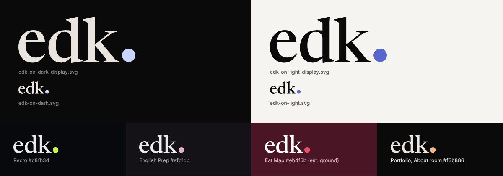

# The maker's mark: `edk.`

Lowercase `edk` in Newsreader 500 with the portfolio's dot after it. It is the maker's signature,
not a product logo: in an app it appears **only at exits** (owner, 2026-10-09): the About or
credits screen, the press kit, social cards. Never in working UI, never beside a toolbar, never
in a loading screen.



## Files

All outlined (no font needed), drawn by `build.py` from the site's own subset font
(`src/fonts/newsreader-latin.woff2`): weight 500, the bar's tracking −0.01 em, the face's own
kerning (none between these letters), and the site's dot (a circle 0.22 em across, 0.07 em after
the k, resting on the baseline). The letters match the live site to the CSS pixel.

| File | Use |
|---|---|
| `edk-on-dark.svg` | Letters `#e9e5de`, dot `#c9d4ff` (13.5:1 on `#0a0a0b`), for dark grounds |
| `edk-on-light.svg` | Letters `#0a0a0b`, dot `#5967cc` (4.5:1 on `#f6f4f0`, 5.0:1 on white), for light grounds |
| `edk-inline.svg` | Letters `currentColor`, dot `var(--edk-dot, currentColor)`: paste inline, set the dot per product |
| `edk-letters.svg` + `edk-dot.svg` | One shape each on the same viewBox, for asset catalogues (Xcode: Preserve Vector Data, render as Template) and anything that layers two tints |
| `*-display.svg` | The same set at Newsreader's display optical size (opsz 72) |
| `build.py` | Regenerates every file; deterministic |

**Optical cuts.** The default files are opsz 26, exactly what the bar draws; use them for a mark
under 48 px tall. From 48 px up (press posters, social cards, title slides) use `-display`: finer
hairlines and tighter spacing, as the face intends at that size.

**Geometry.** viewBox in font units (2000 per em), y = 0 is the baseline. Text cut: ink
1.772 × 0.727 em; display cut 1.923 × 0.758 em. The SVGs' intrinsic size assumes a 100 px em;
set `height` and let width follow.

## Usage

- **Clear space**: at least 0.6 × the mark's height on every side (two dot diameters). Nothing
  else (text, edge, other marks) inside it.
- **Minimum size**: 10 px ink height on screen (about 14 px type), 3 mm in print. Smaller than
  that, set `edk.` as text in the host's own type instead (credits option A below).
- **Colour**: letters are always ink: the host's primary ink on dark, its darkest ink on light.
  The **dot takes the host product's colour** (Recto lime `#c8fb3d`, English Prep Sakura
  `#efb1cb`, Eat Map rose `#eb4f6b`), and on a light ground the product's light-theme accent at
  ≥ 3:1. In the portfolio the dot takes the room's light. Never letters in the accent.
- **Never**: outline, glow, shadow, gradient, glass effect, rotation, stretching, re-spacing,
  re-setting in another face, the period glyph in place of the dot, a lockup with a product's
  logo (except the social card: product mark left, `edk.` small bottom right, family.md §4.1),
  placement over a busy photo.
- **Where**: About or credits (one line), press kit, social cards, the portfolio. Not in app
  icons, splash screens, navigation, toolbars or empty states.
- **Accessible name**: "edk" (the dot is decoration); a link reads "Made by edk, the maker's
  portfolio" or its translation.

## The credits line

One line at the foot of the product's About or credits screen, in the product's own type and
voice, linking to the product's view in the portfolio: `https://erendenizk.github.io/work/<slug>/`.

**Wording (for the owner to choose):**

| | English | Turkish (English Prep, *sen*) | Note |
|---|---|---|---|
| **1** *(recommended)* | Made by edk. | Yapan: edk. | Shortest; the mark does the talking; the dot is the line's full stop |
| **2** | Made by Eren Deniz Kuyucaklıoğlu · edk. | Eren Deniz Kuyucaklıoğlu yaptı · edk. | Full name for findability (brief §7); longer, reads more like a byline |
| **3** | Kept light, by edk. | — (does not translate; keep English) | Uses the family's internal name; only if the owner likes "Kept light" in public |

**Two ways to set `edk.`** (family.md §6.1 Q5: each product keeps its own faces, so A is the
default; B needs the owner's yes to option d):

- **A. Text in the product's own type**, with the dot drawn as the portfolio's circle in the
  product's colour.
- **B. The drawn mark** (`edk-inline.svg`), Newsreader outlines inside the product's line.

### Web

```html
<!-- A: the product's type; the dot is a circle in the product's colour -->
<p class="edk-credit">Made by <a href="https://erendenizk.github.io/work/recto/"
   aria-label="Made by edk, the maker's portfolio">edk<span class="edk-credit__dot"></span></a></p>
```

```css
/* family kit, mark/README.md. --edk-dot: the product's accent (Recto #c8fb3d, English Prep #efb1cb). */
.edk-credit { margin: 0; color: var(--ink-2, inherit); }
.edk-credit a { color: var(--ink, inherit); text-decoration: none; white-space: nowrap; }
.edk-credit a:hover { text-decoration: underline; text-underline-offset: 0.2em; }
.edk-credit__dot {
  display: inline-block; width: 0.22em; height: 0.22em; margin-left: 0.07em;
  border-radius: 50%; background: var(--edk-dot, currentColor);
}
@media (forced-colors: active) {
  .edk-credit__dot { forced-color-adjust: none; background: LinkText; }
}
```

```html
<!-- B: the drawn mark; paste the two <path> elements from edk-inline.svg into the <svg> -->
<p class="edk-credit">Made by <a href="https://erendenizk.github.io/work/recto/"
   aria-label="Made by edk, the maker's portfolio"><svg class="edk-credit__mark"
   viewBox="70 -1431 3545 1453" aria-hidden="true"><!-- paths --></svg></a></p>
```

```css
/* 0.92 em gives Newsreader's x-height about the x-height of Inter or SF at the same size; baselines meet */
.edk-credit__mark { height: 0.92em; width: auto; vertical-align: -0.014em; fill: currentColor; }
.edk-credit__mark .edk-dot { fill: var(--edk-dot, currentColor); }
```

English Prep builds DOM without `innerHTML`: create the `<svg>` and `<path>` nodes with
`document.createElementNS('http://www.w3.org/2000/svg', …)` and set `d` from the file.

### SwiftUI

```swift
// A: system type, Dynamic Type, the dot as the period in the product's colour (iOS 17+).
struct MadeByEDK: View {
    var dot: Color = Color(red: 235 / 255, green: 79 / 255, blue: 107 / 255) // Eat Map rose #eb4f6b
    var url = URL(string: "https://erendenizk.github.io/work/eat-map/")!

    var body: some View {
        Link(destination: url) {
            Text("Made by ").foregroundStyle(.secondary)
                + Text("edk").foregroundStyle(.primary)
                + Text(".").foregroundStyle(dot)
        }
        .font(.footnote)
        .accessibilityLabel("Made by edk, the maker's portfolio")
    }
}

// B: the drawn mark. Add edk-letters.svg and edk-dot.svg to the asset catalogue (Preserve
// Vector Data, Render As: Template Image); they share one viewBox, so they overlay exactly.
struct EDKMark: View {
    var dot: Color
    @ScaledMetric(relativeTo: .footnote) private var height: CGFloat = 10

    var body: some View {
        ZStack {
            Image("edk-letters").resizable().scaledToFit().foregroundStyle(.primary)
            Image("edk-dot").resizable().scaledToFit().foregroundStyle(dot)
        }
        .frame(height: height)
        .accessibilityElement()
        .accessibilityLabel("edk")
    }
}
```

## Rebuilding

```sh
pip install fonttools brotli skia-pathops
python3 docs/family-kit/mark/build.py
```

The script instances the variable font at wght 500 and the two optical sizes, unions the
overlapping contours (skia-pathops) so every file is one clean path for the letters and one for
the dot, and prints each cut's viewBox.
